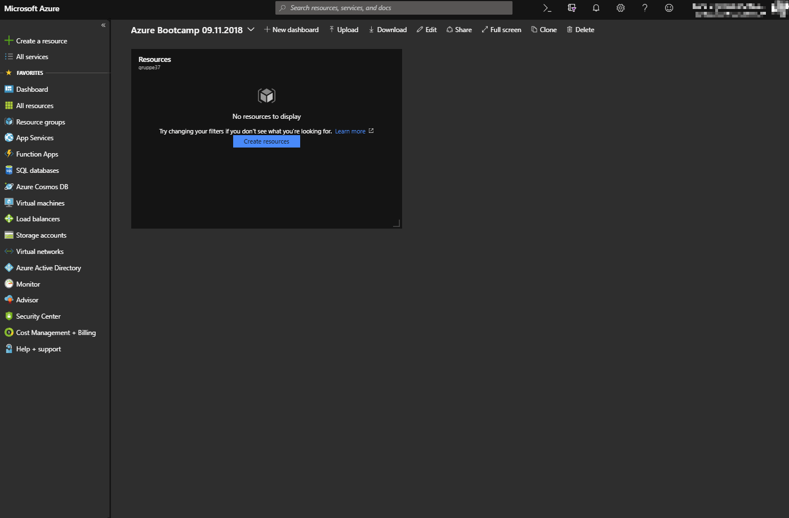
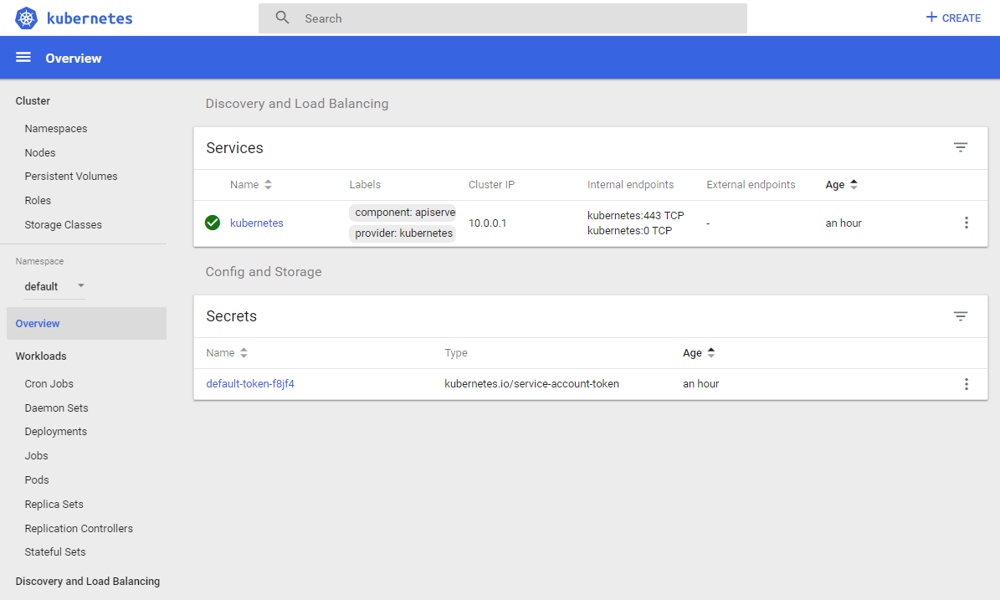
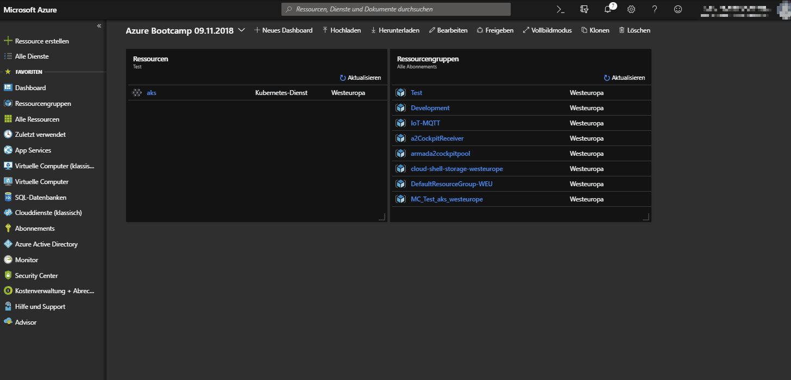
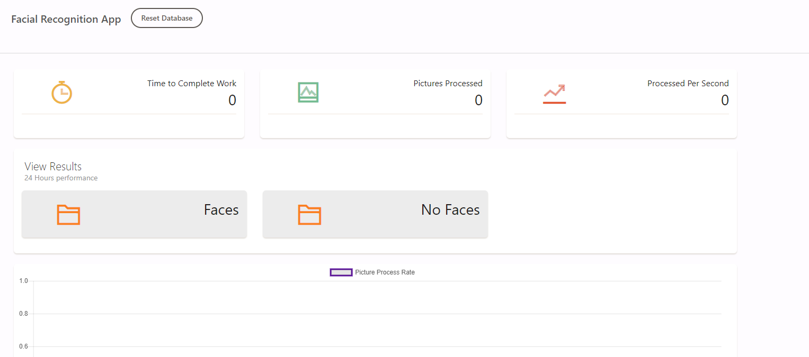
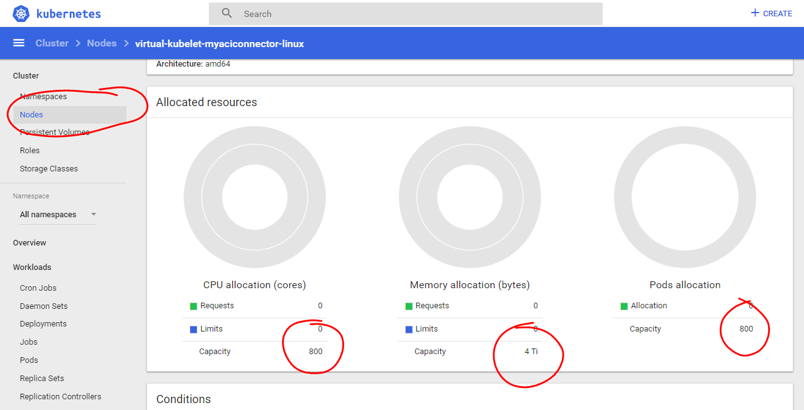

# Burst AKS with ACI Virtual Kubelet 

This demo is based on Ria Bhatia (Microsoft) ACI Demo:   https://github.com/rbitia/aci-demos

#### Table of Contents

* [Prerequiste](#prerequisite)
* [Create AKS in Azure Portal](#aks)
* [Deploy the application](#demo)
* [Burst AKS with ACI](#kublet)

## Prerequisite

* A [Microsoft Azure account](https://azure.microsoft.com/en-us/free/).
* Install the [Azure CLI](#install-the-azure-cli).
* (Recommended) Install [Git](#install-git).  

### Install the Azure CLI

Install `az` by following the instructions for your operating system.
See the [full installation instructions](https://docs.microsoft.com/en-us/cli/azure/install-azure-cli?view=azure-cli-latest) if yours isn't listed below.

#### MacOS
```cli
brew install azure-cli
```

#### Windows
https://aka.ms/installazurecliwindows

### Install Git
See the [full instructions](https://docs.microsoft.com/en-us/azure/devops/learn/git/install-and-set-up-git).


# Create AKS in Azure Portal



1. Login into Azure Portal.
2. Create new Ressources.
3. Select Kubernetes Service.
4. Select your Ressourcegroup (provided in the session).
5. Enter a name, i.e. aks.
6. Enter a DNS prefix, i.e. azure.
7. Continue to Authentification (make sure RBAC is deactivated).
8. Continue to Network and activate HTTP Application Routing.
9. Continue to Monitoring
10. Create AKS

Sometimes there is a problem during the precheck (caused by the service principal isn't created as fast as expected). Just go one step back and click create again. This time it should work.

# Clone or Download YAML Files

Go to Github and clone (or download) the repository.

```Powershell
PS H:\azure> git clone https://github.com/ArvatoSystems/Serverless-HandsOn1.git
```

# Login to your Azure Subscription

Login to your Azure Subscription:

```Powershell
PS H:\azure\Serverless-HandsOn1\k8s> az login
{
  "environmentName": "AzureCloud",
  "id": "************",
  "isDefault": true,
  "name": "Visual Studio Premium mit MSDN",
  "state": "Enabled",
  "tenantId":"************",
  "user": {
    "name": "***@***.**",
    "type": "user"
  }
}
...
```

Please remember your Subscritpion ID and your Tenant ID. Field "id" and "tenantId". 

## AKS Credentials & Login

Install kubectl.exe: 
```Powershell
PS H:\azure\Serverless-HandsOn1\k8s> az aks install-cli
```

Get Kubernetes Credentials:
```Powershell
PS H:\azure\Serverless-HandsOn1\k8s> az aks get-credentials --resource-group <your recource group> --name <your aks name>
```

Now you can access your AKS via CLI, check if it is up an running:
```Powershell
PS H:\azure\Serverless-HandsOn1\k8s> kubectl.exe get nodes
NAME                                   STATUS    ROLES     AGE       VERSION
aks-agentpool-25033075-0               Ready     agent     1h        v1.11.3
aks-agentpool-25033075-1               Ready     agent     1h        v1.11.3
aks-agentpool-25033075-2               Ready     agent     1h        v1.11.3
```

Open the Browser Dashboard (using az aks browse, will open the browser):
```Powershell
PS H:\azure\Serverless-HandsOn1\k8s> az aks browse --resource-group <your recource group> --name <your aks name>
```

Or by using kubectl.exe to open the [Dashboard](http://localhost:8001/api/v1/namespaces/kube-system/services/kubernetes-dashboard/proxy/#!/overview?namespace=default) link in the browser by yourself.

```Powershell
PS H:\azure\Serverless-HandsOn1\k8s> kubectl.exe proxy
```
!!! az aks browse will have a different URL then kubectl.exe

Kubernetes Dashboard:



# Deploy the application

Girst get HTTP application routing domain from Azure Portal.



It should look something like: `<random string>.westeurope.aksapp.io`
Prepend an application name like `demo.` to it.

You should get: `demo.<random string>.westeurope.aksapp.io`
 
Edit deployments.yaml (Line 172) and replace `<HTTP application routing domain>` with  your `demo.<random string>.westeurope.aksapp.io`.

## Create the deployments
Next create application deployments in kubernetes:
```Powershell
PS H:\azure\Serverless-HandsOn1\k8s> kubectl.exe apply -f .\deployments.yaml
```
This will create the frontend, backend and worker pods.
Check if all deployments are up: 
```Powershell
PS H:\azure\Serverless-HandsOn1\k8s> kubectl.exe get deployments
NAME               DESIRED   CURRENT   UP-TO-DATE   AVAILABLE   AGE
demo-fr-backend    1         1         1            1           1m
demo-fr-frontend   1         1         1            1           1m
demo-fr-ir         1         1         1            1           1m
demo-fr-ir-aci     0         0         0            0           1m
```
Notice: demo-fr-ir-aci is scaled to 0, we will need it later.

## Create the services
Now create the service:
```
PS H:\azure\Serverless-HandsOn1\k8s> kubectl.exe apply -f .\services.yaml
```
And check if they are up:
```
PS H:\azure\Serverless-HandsOn1\k8s> kubectl.exe get services
NAME               TYPE        CLUSTER-IP     EXTERNAL-IP   PORT(S)    AGE
demo-fr-backend    ClusterIP   10.0.30.239    <none>        80/TCP     51s
demo-fr-frontend   ClusterIP   10.0.105.161   <none>        8080/TCP   51s
kubernetes         ClusterIP   10.0.0.1       <none>        443/TCP    1h
```
This will expose your frontend and backend internaly using a cluster ip.

## Create the ingress
Edit ingress.yaml (Line 14 and 35) and replace `<HTTP application routing domain>` with  your `demo.<random string>.westeurope.aksapp.io`.
```
PS H:\azure\Serverless-HandsOn1\k8s> kubectl.exe apply -f .\ingress.yaml
```

```
PS H:\azure\Serverless-HandsOn1\k8s> kubectl.exe get ingress
NAME               HOSTS                                            ADDRESS        PORTS     AGE
demo-fr-backend    demo.6de59834c15749e6a0fa.westeurope.aksapp.io   13.93.78.133   80        1m
demo-fr-frontend   demo.6de59834c15749e6a0fa.westeurope.aksapp.io   13.93.78.133   80        1m
```
This will expose our frontend and backend endpoint externaly.

!!! Before going on check if the DNS record has been made:

```
PS PS H:\azure\Serverless-HandsOn1\k8s> kubectl --namespace kube-system logs   -lapp=addon-http-application-routing-external-dns

time="2018-11-06T08:08:22Z" level=info msg="config: &{Master: KubeConfig: Sources:[service ingress] Namespace: AnnotationFilter:kubernetes.io/ingress.class=addon-http-application-routing FQDNTemplate:
Compatibility: PublishInternal:false Provider:azure GoogleProject: DomainFilter:[6de59834c15749e6a0fa.westeurope.aksapp.io] AWSZoneType: AzureConfigFile:/etc/kubernetes/azure.json AzureResourceGroup:MC_Test_aks_westeurope CloudflareProxied:false InfobloxGridHost: InfobloxWapiPort:443 InfobloxWapiUsername:admin InfobloxWapiPassword: InfobloxWapiVersion:2.3.1 InfobloxSSLVerify:true InMemoryZones:[] Policy:sync Registry:txt TXTOwnerID:default TXTPrefix: Interval:3m0s Once:false DryRun:false LogFormat:text MetricsAddress::7979 LogLevel:info}"
....
time="2018-11-06T09:30:38Z" level=info msg="Updating A record named 'demo' to '13.93.78.133' for Azure DNS zone '6de59834c15749e6a0fa.westeurope.aksapp.io'."
time="2018-11-06T09:30:39Z" level=info msg="Updating TXT record named 'demo' to '"heritage=external-dns,external-dns/owner=default"' for Azure DNS zone '6de59834c15749e6a0fa.westeurope.aksapp.io'."
```
Wait unit you got the `Updating A record named ....`. Now everything is ready to access your application:

Open `demo.<random string>.westeurope.aksapp.io` in your browser:



What expected to see is that images will be sorted regarding if they have a face on it or not.
You'll see a chart showing the number of processed images per second.

Great! You deployed a scalebale, resillient application with frontend, backend, worker, routing, dns...! Just using the yaml Files. Now lets start to scale ;-)

# Burst AKS with ACI

Instead of just scale the number of worker pods in our Kubernetes we are going serverless. 

### Enable ACI in your Subscription
If Azure Container Instances arn't already activated in your subscription please activate it now:

```Powershell
PS H:\azure\Serverless-HandsOn1\k8s> az provider register -n Microsoft.ContainerInstance
```

### Add your Subscription and Tenant ID
Edit aci_connector.yaml and replace `<Subscription Id>` and <Tenanted Id> with your "id" and "TenantId" (don't forget the ").
In case your forgot to write down the id's, you can show again with:

```Powershell
PS H:\azure\Serverless-HandsOn1\k8s> az account show 
{
  "environmentName": "AzureCloud",
  "id": "****this is the subscription id********",
  "isDefault": true,
  "name": "Visual Studio Premium mit MSDN",
  "state": "Enabled",
  "tenantId":"******this is the tenantid******",
  "user": {
    "name": "***@***.**",
    "type": "user"
  }
}
```
### Deploy the ACI Connector
Create the ACI Connector in kubernetes:
```
PS H:\azure\Serverless-HandsOn1\k8s> kubectl.exe apply -f .\aci_connector.yaml
```

A quick check on the nodes should reval a new node:
```
PS H:\azure\Serverless-HandsOn1\k8s> kubectl.exe get nodes -o wide
NAME                                   STATUS    ROLES     AGE       VERSION   EXTERNAL-IP   OS-IMAGE             KERNEL-VERSION      CONTAINER-RUNTIME
aks-agentpool-96671920-0               Ready     agent     2h        v1.11.3   <none>        Ubuntu 16.04.5 LTS   4.15.0-1023-azure   docker://1.13.1
aks-agentpool-96671920-1               Ready     agent     2h        v1.11.3   <none>        Ubuntu 16.04.5 LTS   4.15.0-1023-azure   docker://1.13.1
aks-agentpool-96671920-2               Ready     agent     2h        v1.11.3   <none>        Ubuntu 16.04.5 LTS   4.15.0-1023-azure   docker://1.13.1
virtual-kubelet-myaciconnector-linux   Ready     agent     1m        v1.11.2   <none>        <unknown>            <unknown>           <unknown>
```

And goining to the Dashboard you can see the capability the new node is announced with:



### Scale UP the ACI Worker
Time to scale our worker up by setting the number of replicats to 10:

```
PS H:\azure\Serverless-HandsOn1\k8s> kubectl scale deploy demo-fr-ir-aci --replicas 10
```

# Watch the result in the application
Now the pods will spin up in ACI. This may take 1-2min to create the pods. Afterwards you should see the result in the app:


Thanks!

## Troubleshoot
If the ACI conatainer arn't created there mind be an issue with the connector, just restart it with:
```
PS H:\azure\Serverless-HandsOn1\k8s> kubectl delete pod -l app=myaciconnector-linux-virtual-kubelet-for-aksal-kubelet-for-aks
```
No wories, it will be recreated.

# Credits
Ria Bhatia (Microsoft) https://github.com/rbitia/aci-demos